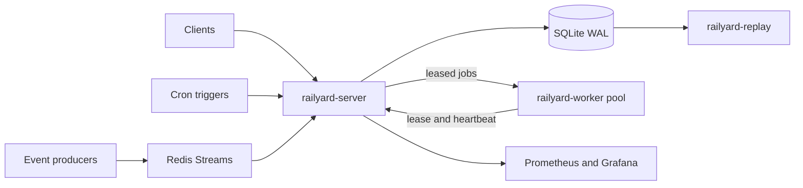

# Rail Yard

Rail Yard is a local-first distributed job orchestrator built to demonstrate the
control-plane problems behind developer platforms: durable scheduling,
event-driven triggers, leases and heartbeats, admission control, deterministic
replay, and failure-oriented testing.

The project is intentionally measured rather than marketed. The performance and
correctness figures below are targets until a qualification run commits the raw
evidence. Resume material will use only measured results.

## Status

- [x] Architecture and acceptance targets defined
- [ ] Durable state machine, worker protocol, and leases
- [ ] DAG scheduler, triggers, retries, and dead-letter queue
- [ ] Chaos campaign and deterministic replay
- [ ] Benchmarks, dashboard, runbook, and measured results

## Correctness contract

Rail Yard guarantees one durable terminal ledger outcome for each accepted
logical job. Payload execution is **at least once**: if a worker dies after a
side effect but before reporting completion, a later attempt can execute the
payload again. Every attempt receives an idempotency key, but external commands
must honor that key to make their own side effects idempotent.

The chaos criteria therefore distinguish:

- canonical terminal outcomes, which must never be lost or duplicated; and
- payload attempts, which may repeat after lease expiry and are reported
  separately.

## Architecture



One Go module produces three binaries:

### `railyard-server`

The control plane owns all durable state.

- DAG-aware jobs declare dependencies, priority, queue, tenant, and slot cost.
- Equal-weight deficit round robin provides queue fairness; each queue is
  priority-then-FIFO with a stable job-ID tie-breaker.
- SQLite runs in WAL mode with full synchronous durability. Sequence-ordered
  transactional writes prevent a restart from resurrecting settled state.
- Workers hold fenced leases, heartbeat every second, and lose ownership when a
  three-second lease expires.
- Triggers come from upstream DAG completion, durable cron occurrences, and a
  Redis Streams consumer group.
- Retries use bounded exponential backoff around 2 s, 4 s, 8 s, and 16 s with
  deterministic jitter, followed by a dead-letter record containing the full
  failure context.
- Per-tenant queue caps reject overload explicitly rather than hiding it as
  latency.

### `railyard-worker`

Workers long-poll for leases, execute no-op or argv-based command payloads,
report status, and renew leases. Command execution is opt-in, bounded, and runs
as a non-root user in the reference deployment.

### `railyard-replay`

Every scheduling decision records its complete canonical input: ready jobs,
queue depths and deficits, priorities, capacities, configuration, and logical
clock. Replay feeds those records through the same scheduler and byte-compares
the resulting canonical decisions. Divergence is a correctness failure.

## State and failure model

Jobs move through:

```text
PENDING -> SCHEDULED -> RUNNING -> SUCCEEDED
                         |     \-> RETRYING -> SCHEDULED
                         \------> FAILED | DEAD_LETTER
```

Dependencies keep a job `PENDING` until all parents succeed. Each transition
uses a state version, and every lease uses a monotonically increasing
generation. A stale worker cannot heartbeat or complete a newer attempt.

Redis is a trigger transport, never the source of truth. A stream delivery is
deduplicated and committed to SQLite before acknowledgement, so redelivery
after a crash is harmless.

## Observability

The server exposes bounded-cardinality Prometheus metrics for:

- scheduling and completion rate;
- queue depth and admission rejections;
- lease expiry and reassignment latency;
- retry and dead-letter counts;
- SQLite transaction latency and busy time; and
- end-to-end job latency.

A provisioned Grafana dashboard and an operator runbook will ship with the
reference Docker Compose environment.

## Milestones

### P1 — durable execution

Implement the state machine, SQLite persistence, one worker, fenced leases,
heartbeats, and the reaper.

Gate: kill a worker during a no-op job, reassign the job within five seconds,
and commit exactly one terminal ledger outcome.

### P2 — orchestration features

Add DAG dependencies, fair priority scheduling, cron and Redis Stream triggers,
deterministic retry jitter, the dead-letter queue, and admission control.

Gate: deterministic property, race, and Docker integration suites pass.

### P3 — failure evidence

Add targeted crash failpoints, a seeded chaos controller, independent ledger
reconciliation, and deterministic replay.

Gate: ten 50,000-job chaos runs reconcile with no lost or duplicate canonical
terminal outcomes, and three full replays match byte-for-byte.

### P4 — measured operations

Add transaction batching, benchmark tooling, Prometheus, Grafana, raw result
artifacts, and the runbook.

Gate: complete all qualification criteria below on the documented host.

## Qualification targets

These are acceptance targets, not achieved results:

1. **Throughput:** three-run median of at least 10,000 durable no-op scheduling
   decisions per minute on one host with eight worker processes. Every run must
   also reconcile all accepted jobs to successful terminal outcomes.
2. **Chaos correctness:** ten seeded runs of 50,000 accepted jobs, with random
   worker kills and one server kill per run, produce zero lost and zero
   duplicate canonical terminal outcomes.
3. **Recovery:** dead-worker jobs receive a durable successor lease within five
   seconds at p99 across the chaos campaign, using one-second heartbeats.
4. **Determinism:** three fresh-process replays reproduce 100% of canonical
   scheduling decisions byte-identically.

Raw manifests, seeds, action traces, reconciliation reports, samples, replay
digests, and checksums will be committed under `results/`. If a result misses a
target, the measured number will be published unchanged.

## Technology

- Go, standard library HTTP/JSON, and `os/exec`
- `modernc.org/sqlite` with SQLite WAL
- `github.com/redis/go-redis/v9` and Redis Streams
- `github.com/prometheus/client_golang` and Grafana
- Docker Compose for the canonical Linux environment
- GitHub Actions for lint, unit, race, integration, replay, and chaos checks

The system is designed to run locally without cloud spend.

## Resume activation

Once qualification evidence is committed, send:

```text
built: railyard
```

with the four measured values: no-op scheduling rate, chaos reconciliation
result, worker reassignment p99, and replay match percentage. Until then, this
repository describes work in progress rather than verified resume evidence.
